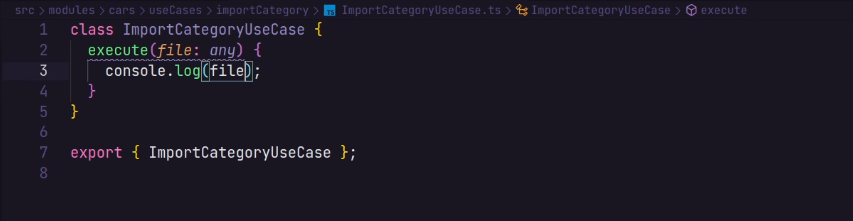

## Aula XXVI
> Configurando ts-node-dev

- Iniciar aplicação rentalx
```bash
yarn init -y
yarn add express
yarn add @types/express -D
yarn add typescript -D
yarn tsc --init
yarn ts-node-dev -D
```
- Adicionar script no package.json
```bash
"scripts": {
    "dev": "ts-node-dev --transpile-only --ignore-watch node-modules --respawn src/server.ts"
},
```
- Padronização de código com [eslint](https://www.youtube.com/watch?v=rCeGfFk-uCk&t=1935s) e prettier
- Desabilitar no `tsconfig.json` a conf `strict`
- Testar rota
```typescript
import express from "express";

const app = express();

app.get("/", (request, response) => {
  return response.json({ message: "Hello World" });
});

app.listen(3333, () => console.log("Server is running"));
```
## Aula XXVII
> Debugando aplicação

O uso do `console.log` apesar de funcionar muitas vezes para ajudar achar o erro na aplicaão, muitas vezes não é o mais rápido e eficiente. Afim de agilizar o nosso processo vamos começar a utilizar a ferramenta de debug do vscode. No lado esquerdo da tela, próimo ao eplorador do vscode, vamos abrir a seção de executar e depurar e clicar na opção de "create a launch.json file" e selecionar a opção de Node.js
```json
{
  "version": "0.2.0",
  "configurations": [
    {
      "type": "node",
      "request": "attach",
      "name": "Launch Program",
      "skipFiles": ["<node_internals>/**"],
      "outFiles": ["${workspaceFolder}/**/*.js"]
    }
  ]
}
```
Após feito a configuração podemos rodar o comando `yarn dev` selecionar o break point e clicar no botão de :arrow_forward: do depurador. É possível observar as variáveis presentens no processo adicionando-as precionando o botão de :heavy_plus_sign: .

## Aula XXVIII
> Criando Categoria

O diagrama abaixo represata de como iremos montar nossa aplicação com as tabelas que iremos criar


Agora iremos iniciar trabalhando nas nossas rotas. Para isso, dentro da pastas `src` vamos criar outro diretório chamado `routes` e dentro criar um arquivo `categorias.routes.ts` onde iremos importar o `Router` do `express`, em seguida guardamos o  `Router` em uma const (de preferência que faça referência ao tipo da rota por exemplo, `categoriesRoutes`) para fazermos a criação de nossas rotas e exportamos ela no fim do arquivo.

**Exemplo de Rota criada:**

```typescript
import { Router } from "express";

const categoriesRoutes = Router();

const categories = [];

categoriesRoutes.post("/", (request, response) => { // apenas "/" pois iremos passar o "/categories" junto ao nosso middleware
  const { name, description } = request.body;

  categories.push({
    name,
    description,
  });

  return response.status(201).send(); //.send() obrigatório sempre que n for passando um json ou algo do tipo
});

export { categoriesRoutes };

```

Para podermos usar as rotas criadas neste arquivo precisamos fazer duas coisas importar no arquivo `server.ts` e dar use => `app.use("/categoris",categoriesRoutes)`, onde o primeiro termo passado no nosso middleware significa a rota que sempre irá fazer. agora podemos verificar se está tudo rodando corretamente.

## Aula XXIX
> Inserindo Id com uuid

Para criarmos nossos id por motivos de segurança simulando o que ocorre normalemnte no cenário real, iremos utilizar o formato uuid que nada mais é que um Identificador Único Universal. Assim, iremos utilizar a biblioteca uuid na qual conta com algumas opções de formatos do uuid, escolheremos a v4 que gera a chave a partir de números aleatórios.
```bash
yarn add uuid
```

## Aula XXX
> Inserindo Tipagem para Categoria

Afim de criar uma estrutura de dados que serão passados no `POST/categories` vamos criar justamente um modelo que nossa categoria irá ter. Dessa forma, na pasta `src/` vamos criar outro diretório, `model` e nele criar um arquivo chamado `Category.ts`, onde vamos criar a seguinte estrutura, utilizando-se das funciolidades de tipagem do typescript:
```typescript
import { v4 as uuidv4 } from "uuid"; // importando a lib uuid

class Category { // criando o objeto/modelo
  id?: string; // o caractere '?' indica que é opicional
  name: string; //usamos as tipagens do typescript
  description: string;
  created_at: Date;

  constructor() { // o constructor é semelhante a um método que só é cahmado apenas quando o objeto é instânciado 
    if (!this.id) {
      this.id = uuidv4();
    }
  }
}

export { Category };
```

E agora, no arquivo `categories.routes.ts`, na criação das rotas vamos utilizar esse objeto como um tipo, como no exemplo da criação de uma rota:
```typescript
categoriesRoutes.post("/", (request, response) => {
  const { name, description } = request.body;

  const category = new Category(); // instanciando o objeto

  Object.assign(category, { // Utilizando esta função passamos como primeiro parâmetro o objeto e como segundo parâmetro os atributos.
    name,
    description,
    created_at: new Date(),
  });

  categories.push(category);

  return response.status(201).json({ category });
});
```

## Aula XXXI
> Criando um Repositório de Categoria

Repositórios ou Repositories é a camada responssável por fazer a manipulação de dados na aplicação, no momento na nossa aplicação essa responsabilidade está por conta das nossas rotas. Afim de resolver essa problemática, iremos criar um diretório dentro do `src/` chamado `repositories/` e nele, um arquivo representando o repositório das categorias `CategoriesRepository`, com a seguinte estrutura:

```typescript
import { Category } from "../model/Category";

// Sempre quer formos criar um objeto que vai receber informaçãoes vindas da rota, vai criar os DTO para pegar os valores vindos da rota e receber em nossos repositórios
interface ICreateCategoryDTO {
  name: string;
  description: string;
}

class CategoriesRepository {
  private categories: Category[];

  constructor() {
    this.categories = [];
  }

  // responssávelpor cadastrar nossa categoria e será importada nas rotas
  // Vamos dizer aqui que tipo de informações iremos receber na rota com ajuda do DTO
  // informamos que o retorno desse método é vasio (void) jáque iremos apenas salvar os dados no db
  create({ name, description }: ICreateCategoryDTO): void {
    // instanciamos o nosso model
    const category = new Category();

    Object.assign(category, {
      name,
      description,
      created_at: new Date(),
    });

    this.categories.push(category);
  }
}

export { CategoriesRepository };
```

E no nosso arquivo de rotas vamos fazer algumas modificações:

```typescript
import { Router } from "express";

import { CategoriesRepository } from "../repositories/CategoriesRepository";

const categoriesRoutes = Router();
const categoriesRepository = new CategoriesRepository(); // instanciando

categoriesRoutes.post("/", (request, response) => {
  const { name, description } = request.body;

  // utilizando o método create passando as infos vindas do client
  categoriesRepository.create({ name, description });

  return response.status(201).send();
});

export { categoriesRoutes };
```

## Aula XXXII
> Listando Categorias

Ainda no nosso arquivo `CategoriesRepository` vamos criar  um método para listar nossas categorias da seguinte maneira:
```typescript
// informamos o retorno do nosso método que no casso é um array de Category
list(): Category[] {
  return this.categories; // retornando nosso array
}
```
`categories.routes.ts`:
```typescript
categoriesRoutes.get("/", (request, response) => {
  // guardando informação que retornou do método
  const all = categoriesRepository.list();
  // retonando
  return response.json(all);
});
```

## Aula XXXIII
> Validando Cadastro de Categoria

Para a nossa validação, vamos criar um método no nosso repositório chamado `findByName` onde iremos buscar uma categoria com aquele nome recebido na rota e retornará uma categoria.
```typescript
findByName(name: string): Category {
  const category = this.categories.find((category) => category.name === name);
  return category;
}
```
para validação vamos fazer uma logica simple onde passamos o `name` passado no body, caso retorne uma categoria significa que já existe uma categoria com esse nome, nesse caso vamos retornar um `json` com a mensagem de erro, caso contrário, a rota seguirá  normalmente criando uma categoria com o novo `name`.
```typescript
const categoryAlreadyExists = categoriesRepository.findByName(name);

if (categoryAlreadyExists) {
  return response.json({ error: "category Already Exists" });
}
```

## Aula XXXIV
> Entendendo o S.O.L.I.D

"SOLID são cinco princípios da programação orientada a objetos que facilitam no desenvolvimento de softwares, tornando-os fáceis de manter e estender. Esses princípios podem ser aplicados a qualquer linguagem de POO."
[ref](https://medium.com/desenvolvendo-com-paixao/o-que-%C3%A9-solid-o-guia-completo-para-voc%C3%AA-entender-os-5-princ%C3%ADpios-da-poo-2b937b3fc530)


S.O.L.I.D: Os 5 princípios da POO
1. S — Single Responsiblity Principle (Princípio da responsabilidade única)
2. O — Open-Closed Principle (Princípio Aberto-Fechado)
3. L — Liskov Substitution Principle (Princípio da substituição de Liskov)
4. I — Interface Segregation Principle (Princípio da Segregação da Interface)
5. D — Dependency Inversion Principle (Princípio da inversão da dependência)

Caso a aplicação seja muito simples e não há prospecções de crescimento, o SOLID não faz muito sentido ser aplicado, ou pelo menos não por completo. Para saber se ou não implementar e quando implementar, é necesário a compreensão de cada princípio.

## Aula XXXV
> Utilizando o Princípio de Responsabilidade Única (SRP)

SRP — Single Responsibility Principle:
Princípio da Responsabilidade Única — Uma classe deve ter um, e somente um, motivo para mudar.

Esse princípio declara que uma classe deve ser especializada em um único assunto e possuir apenas uma responsabilidade dentro do software, ou seja, a classe deve ter uma única tarefa ou ação para executar.
Caso que não ocorre nas nossas rotas, onde no POST/categories vemos validação, criação, alí no mesmo contexto.

Para isolar essa parte iremos criar uma nova classe, a classe de services. No diretório `src/`, vamos criar a pasta `services/` e nele o arquivo `CreateCategoryService` com a seguinte estrutura:
```typescript
// importando Repositório para definir o tipo do objeto que o CreateCategory vai receber quando for instanciado
import { CategoriesRepository } from "../repositories/CategoriesRepository";

//definimos os tipos dos parâmetros passados no 'execute'
interface IRequest {
  name: string;
  description: string;
}

class CreateCategoryService {
  // Precisamos do repositório porém outros services também irão precisar, não podemos instancialo aqui pois a cada vez que instanciarmos será criado um novo repositório
  // A responsabilidade de criar ficará para quem chama o service no caso a rota
  constructor(private categoriesRepository: CategoriesRepository) {}
  
  // especificando o retorno do método como vazio
  execute({ description, name }: IRequest): void {
  
  // this é usado por conta da privete 
    const categoryAlreadyExists = this.categoriesRepository.findByName(name);

    if (categoryAlreadyExists) {
  
  // tiramos o response pois isso é da responsabilidade da rota
      // tratando o erro com  'throw'
      throw new Error("Category Already Exists");
    }

    this.categoriesRepository.create({ name, description });
  }
}

export { CreateCategoryService };
```

POST/category:
```typescript
categoriesRoutes.post("/", (request, response) => {
  const { name, description } = request.body;

//instanciando e passando o repositório como parâmetro
  const createCategoryService = new CreateCategoryService(categoriesRepository);

  // executando o método e passando como parâmetro as variáveis  vindas do body
  createCategoryService.execute({ name, description });

  return response.status(201).send();
});
```
## Aula XXXVI
> Utilizando o Princípio da Substituição de Liskov (LSP)

LSP— Liskov Substitution Principle:
Princípio da substituição de Liskov — Uma classe derivada deve ser substituível por sua classe base.
O princípio da substituição de Liskov foi introduzido por Barbara Liskov em sua conferência “Data abstraction” em 1987.

**A definição formal de Liskov diz que:**

*"Se para cada objeto o1 do tipo S há um objeto o2 do tipo T de forma que, para todos os programas P definidos em termos de T, o comportamento de P é inalterado quando o1 é substituído por o2 então S é um subtipo de T."*

**Um exemplo mais simples e de fácil compreensão dessa definição. Seria:**

*"Se S é um subtipo de T, então os objetos do tipo T, em um programa, podem ser substituídos pelos objetos de tipo S sem que seja necessário alterar as propriedades deste programa."*

Em modos práticos, agora, na nossa aplicação iremos criar um arquivo que definirá a(s) classe(s) do(s) repositório(s) usado(s), `ICategoriesRepository.ts`, nele vamos ter uma interface definido cada método da classe com a seguinte estrutura:

```typescript
import { Category } from "../model/Category";

interface ICreateCategoryDTO {
  name: string;
  description: string;
}

interface ICategoriesRepository {
  findByName(name: string): Category;
  list(): Category[];
  create({ name, description }: ICreateCategoryDTO): void;
}

export { ICategoriesRepository, ICreateCategoryDTO };
```

dando sequência, iremos implementar essas interfaces criadas em nosso repositório e no nosso service, tipando ele com o `ICategoriesRepository.ts`

`CategoriesRepository.ts`:
```typescript
// imporatando model
import { Category } from "../model/Category";
import {                          // importando interfaces
  ICategoriesRepository,
  ICreateCategoryDTO,
} from "./ICategoriesRepository";

// implementando interface
class CategoriesRepository implements ICategoriesRepository {
  private categories: Category[];

  constructor() {
    this.categories = [];
  }

  create({ name, description }: ICreateCategoryDTO): void { // retorno: vazio
  // regras de negócio
    const category = new Category();

    Object.assign(category, {
      name,
      description,
      created_at: new Date(),
    });

    this.categories.push(category);
  }

  list(): Category[] { // retorno: array de Category
  // regras de negócio
    return this.categories;
  }

  findByName(name: string): Category { // um category
  // regras de negócio
    const category = this.categories.find((category) => category.name === name);
    return category;
  }
}

export { CategoriesRepository };

```
`CreateCategoryService.ts`:
```typescript
import { ICategoriesRepository } from "../repositories/ICategoriesRepository";

interface IRequest {
  name: string;
  description: string;
}

class CreateCategoryService {
  constructor(private categoriesRepository: ICategoriesRepository) {} //recebe interface

  execute({ description, name }: IRequest): void {
    const categoryAlreadyExists = this.categoriesRepository.findByName(name);

    if (categoryAlreadyExists) {
      throw new Error("Category Already Exists");
    }

    this.categoriesRepository.create({ name, description });
  }
}

export { CreateCategoryService };

```

## Aula XXXVII
> Criando Service de Especificação e Separando em Módulos

**Criando Specifications**

Para as Specifications, vamos seguir o [diagrama](#aula-xxviii) onde mostra quais os dados serão guardados, Assim como as Categorias, vamos começar criando o model.
```typescript
import { v4 as uuidv4 } from "uuid";

class Specification {
  id?: string;

  name: string;

  description: string;

  created_at: Date;

  constructor() {
    if (!this.id) {
      this.id = uuidv4();
    }
  }
}

export { Specification };

```

Dando sequeência vamos continuar criando o `CreateSpecificationService.ts`:
```typescript
class CreateSpecificationService {
  execute() {
    console.log("TODO");
  }
}

export { CreateSpecificationService };
```
Além disso vamos criar mais dois arquivos em nosso diretório `repositories/`: `ISpecificationsRepository.ts` e `SpecificationsRepository.ts`
Com nossa aplicação criando tamanho podemos observar que futuramente será inviável visualizar facilmente nossos arquivos no repositories, services, mode. Com o intuito de melhorar nossa visualização ao longo do nosso desenvolvimento, vamos criar no `src/`, um diretório `modules/` onde iremos isolar melhor nossas responsabilidades. Detro da pasta `modules/`, vamos criar a pasta `cars/` que será responssável por tudo que estiver relacionado a carros, por tanto vamos mover as pastas `services/`, `repositories/`, `model/`, para `cars/`

## Aula XXXVIII
> Corrigindo as Importações

Vamos abrir aquirvo o arquivo de rotas e corrigir caso alguma rota esteja fazendo a importação incorretamente.

## Aula XXXIX
> Criando repositório de Especificações

Vamos iniciar criando nossas interfaces, para isso, no arquivo `ISpecificationsRepository.ts`, vamos criar a seguinte estrutura:
```typescript
// importano model
import { Specification } from "../model/Specification";

//interface do create
interface ICreateSpecificationDTO {
  name: string;
  description: string;
}

interface ISpecificationsRepository {
  create({ name, description }: ICreateSpecificationDTO): void; // tipando retorno
  findByName(name: string): Specification; // tipo do retorno igual a objeto
}

export { ISpecificationsRepository, ICreateSpecificationDTO };
```

Agora iremos criar o `SpecificationsRepository.ts` implementando o `ISpecificationsRepository.ts`, da seguinte maneira:
```typescript
import { Specification } from "../model/Specification";
import {
  ICreateSpecificationDTO,
  ISpecificationsRepository,
} from "./ISpecificationsRepository";


class SpecificationsRepository implements ISpecificationsRepository {
  private specifications: Specification[]; // criando tabela(db) fake

  constructor() {
    this.specifications = []; // inicializando nosso array
  }

  create({ name, description }: ICreateSpecificationDTO): void {
    const specification = new Specification(); // instanciando o Specification ou seja, criando um novo

    // colocando os atributos no objeto specification
    Object.assign(specification, {
      name,
      description,
      created_at: new Date(),
    });

    // adicionando no array de specifications
    this.specifications.push(specification);
  }

  findByName(name: string): Specification {
    const specification = this.specifications.find(
      (specification) => specification.name === name
    );

    return specification;
  }
}

export { SpecificationsRepository };
```
E o próximo passo é o `CreateSpecificationService.ts`:
```typescript
import { ISpecificationsRepository } from "../repositories/ISpecificationsRepository";

// Interface simulando a request
interface IRequest {
  name: string;
  description: string;
}

class CreateSpecificationService {

  //para a variável estar disponível para toda a classe
  constructor(private specificationsRepository: ISpecificationsRepository) {}

  // informando que o execute precisa receber esses dois dados com retorno void
  execute({ name, description }: IRequest): void {
    // validando
    const specificationAlreadyExists =
      this.specificationsRepository.findByName(name);

    if (specificationAlreadyExists) {
      // exceção, "caso dê errado"
      throw new Error("Specification already exists");
    }
    // caso esteja tudo certo, crie uma specification
    this.specificationsRepository.create({ name, description });
  }
}

export { CreateSpecificationService };
```

E o próximo passo é criar o arquivo de rotas:
```typescript
//importando Router
import { Router } from "express";

import { SpecificationsRepository } from "../modules/cars/repositories/SpecificationsRepository";
import { CreateSpecificationService } from "../modules/cars/services/CreateSpecificationService";

const specificationsRoutes = Router(); // iniciando rotas
const specificationsRepository = new SpecificationsRepository(); // importando e iniciando nosso repositório

specificationsRoutes.post("/", (request, response) => {
  const { name, description } = request.body;

  // criando specification
  const createSpecificationService = new CreateSpecificationService(
    specificationsRepository
  );

  // recebendo request do body
  createSpecificationService.execute({ name, description });

  return response.status(201).send();
});

export { specificationsRoutes };
```

Importando a rota no `server.ts`:
```typescript
app.use("/specifications", specificationsRoutes);
```
E agora podemos testar no insomnia.

## Aula XL
> Criando os Use Case de Categoria

Nesse momento, mais uma vez, com o intuito de descentralizar asresponssabilidades e melhorar a legibilidade, vamos ajustar a organização do nosso projeto.

Apesar de termos tirado bastante da responsabilidade das nossas rotas, ainda assim fazem operações que não são de sua responsabilidade, responsabilidade essa que seria apenas de receber as requisições e repassar. Para isso vamos criar controllers que ficarão com a atribuição de  receber a requisição e passar a resposta.

Nesse primeiro momento vamos reorganizar um pouco nossa estrutura. Dentro do diretório `cars/` (nosso módulo) vamos criar a pasta `useCasaes/` (regras de negócios) onde separaremos noassas "ações" e a primeira será a `createCategory/` nela vamos por o nosso controller e nosso service (renomear para useCase), além de criar também um index.


`CreateCategoryController.ts`:
```typescript
import { Request, Response } from "express";

import { CreateCategoryUseCase } from "./CreateCategoryUseCase";

class CreateCategoryController {
  // incorporando e iniciando o objeto
  constructor(private createCategoryUseCase: CreateCategoryUseCase) {}

  // criando método importando os tipos do express 
  handle(request: Request, response: Response): Response {
    const { name, description } = request.body;
    
    // executando o método do antido service onde temos nossos de negócio
    this.createCategoryUseCase.execute({ name, description });

    return response.status(201).send();
  }
}

export { CreateCategoryController };
```

Para importarmos o controller para nossa rota vamos vafazer o seguinte, criar um arquivo para instanciar nosso repositório, usecase, para usarmos na nossa rota.
`index.ts`:
```typescript
import { CategoriesRepository } from "../../repositories/CategoriesRepository";
import { CreateCategoryController } from "./CreateCategoryController";
import { CreateCategoryUseCase } from "./CreateCategoryUseCase";

const categoriesRepository = new CategoriesRepository();
const createCategoryUseCase = new CreateCategoryUseCase(categoriesRepository);
const createCategoryController = new CreateCategoryController(
  createCategoryUseCase
);

export { createCategoryController };
```

Em `categories.routes.ts` vamos fazer uma pequena modificação retornando o médodo handle do controller passando o request e o response:
```typescript
categoriesRoutes.post("/", (request, response) => {
  return createCategoryController.handle(request, response);
});
```
E em seguida só checar as importações.

## Aula XLI
> Refatorando a Listagem de Categoria

para listagem de categoria vamos seguir o memso raciocínio, criando um useCase e mover o service criar o controller e criar o index.

No UseCase: criamos a classe `ListCategoriesuseCase` e exportamos ela adicionamos uns constructor onde chamamos e tipamos o nosso reposotório com o Interface (*private*). Criamos um método `execute` com uma tipagem `Category[]` pois é um array do tipo `Category` (*model*), após buscarmos a lista com o método `list()` retornamos as `categories`.
```typescript
import { Category } from "../../model/Category";
import { ICategoriesRepository } from "../../repositories/ICategoriesRepository";

class ListCategoriesuseCase {
  constructor(private categoriesRepository: ICategoriesRepository) {}
  execute(): Category[] {
    const categories = this.categoriesRepository.list();

    return categories;
  }
}
export { ListCategoriesuseCase };
```

Processo semenlhante vai se repetir no controller:
```typescript
import { Request, Response } from "express";

import { ListCategoriesuseCase } from "./ListCategoriesUseCase";

class ListCategoriesController {
  constructor(private listCategoriesUseCase: ListCategoriesuseCase) {}

  handle(request: Request, response: Response): Response {
    const all = this.listCategoriesUseCase.execute();

    return response.json(all);
  }
}

export { ListCategoriesController };
```
Dando sequência vamos ao index, onde vamos instanciar os objetos que serão usados na rota.
```typescript
import { CategoriesRepository } from "../../repositories/CategoriesRepository";
import { ListCategoriesController } from "./ListCategoriesController";
import { ListCategoriesuseCase } from "./ListCategoriesUseCase";

const categoriesRepository = new CategoriesRepository();
const listCategoriesUseCase = new ListCategoriesuseCase(categoriesRepository);
const listCategoriesController = new ListCategoriesController(
  listCategoriesUseCase
);

export { listCategoriesController };
```
E finalmente na rota:
```typescript
  categoriesRoutes.get("/", (request, response) => {
  return listCategoriesController.handle(request, response);
});
```

## Aula XLII
> Conhecendo Singleton Pattern

Singleton é um padrão de projeto de software. Este padrão garante a existência de apenas uma instância de uma classe, mantendo um ponto global de acesso ao seu objeto. Nota linguística: O termo vem do significado em inglês para um conjunto que contenha apenas um elemento. -[Wikipedia](https://pt.wikipedia.org/wiki/Singleton)

Implementando o Singleton em nosso repositório de categorias:
```typescript
class CategoriesRepository implements ICategoriesRepository {
  private categories: Category[];

  private static INSTANCE: CategoriesRepository;

  private constructor() {
    this.categories = [];
  }
  // caso n tenha a instância, crie a instância
  public static getInstance(): CategoriesRepository {
    if (!CategoriesRepository.INSTANCE) {
      CategoriesRepository.INSTANCE = new CategoriesRepository();
    }
    return CategoriesRepository.INSTANCE;
  }
  ...
}
```
[REVISAR](https://www.youtube.com/watch?v=zkzPhD8Lnno&t=399s)

## Aula XLIII
> Separando os repositórios

Agora vamos simplesmente criar uma diretório chamado `implementations/`, dentro do diretório de repositórios para separas as nossas interfaces em seguida ajustar os imports que aparecerem errados.

## Aula XLIII
> Criando Use Case de Especificações

- Criar diretório `createSpecification/` dentro do `useCase/`
- Criar os diretório `index.ts` e `CreateSpecificationController.ts` e mover `CreateSpecificationService.ts` para o diretório criado
- Renomear `CreateSpecificationService.ts` para `CreateSpecificationUseCase.ts` e sua classe seguindo o mesmo padrão
- Controller:
  - Criar uma classe e exportá-la seguindo o modelo das anteriores
  - criar método `handle` que recebe `Request` e `Response` do `express`
  - tipar é método com `Response`
  - pegar o que tem no post/ e passar para o `handle`
  - Criar constructor onde recebe o useCase
- index:
  - instaciar o repositório
  - instanciar o use case e passar o repositório
  - instanciar o controller e passar  o usecase
  - exportar o controller
- Importar o controller na rota e passar o request e o response

## Aula XLIV
> Refatorando as Rotas

Agora vamos fazer um pequeno retoque. Nas rotas vamos criar um index dentro da pasta `routes/` para unificar todas as rotas e exportálas para o server da seguinte maneira:

**`routes/index.ts`**:
```typescript
import { Router } from "express";

import { categoriesRoutes } from "./categories.routes";
import { specificationsRoutes } from "./specifications.routes";

const router = Router();

router.use("/categories", categoriesRoutes);
router.use("/specifications", specificationsRoutes);

export { router };
```
`server.ts`:
```typescript
import { router } from "./routes";

app.use(router);
```
## Aula XLV
> Conhecendo o Multer

Vamos cadasrar as categorias importando um arquivo, lendo o arquivo e salvando, para nos auxiliar vamos utilizar a biblioteca [multer](https://www.npmjs.com/package/multer) para o upload de arquivos.

## Aula XLVI
> Criando Upload de Arquivos

- Instalar o multer: `yarn add multer`
- Instalar as tipagens do multer: `yarn add @types/multer -D`
- Criar rota: `categoriesRoutes.post("/import", (request, response) =>{})`
- Instanciar o multer: `const upload = multer()`
- Criar pasta `temp/` na raiz no projeto
- setar o pasta de destino do upload: `const upload = multer({dest: "./temp"})`
- passar o multer como middleware: `categoriesRoutes.post("/import", upload.single("file"), (request, response) =>{})` obs.: o nome do arquivo q será passad, será "file"

Visualizando o arquivo importado

```typescript
categoriesRoutes.post("/import", upload.single("file"), (request, response) =>{
  const { file } = request;
  console.log(file);
  return response.send();
})
```

No insommia vamos criar nossa request post e no body vamos escolher "Multipart Form", por nossa rota "/categories/import" e por no campo "name" do Multipart "file" e no value, escolher "file".

## Aula XLVII
> Criando o Use Case  para Importar Categorias

Dentro do diretório `useCases/` vamos criar o diretório do nosso useCase `importCategory/` e os três arquivos assim como nos demais useCases, sendo eles:
- [] **ImportCategoryController.ts**
- [] **ImportCategoryUseCase.ts**
- [] **Index.ts**

Vamos dar início por aqui criando nosso método handle na nossa classe controller, seguindo a mesma ideia de nomenclatura das classes feitas até aqui. no handle, nós recebemos o request e o reponse tipando nosso retorno como Response e recebemos nosso "file" do request => `const { file } = request`. Para visualizarmos o arquivo, damos um `console.log(file);` e um `return response.send();`.

Para já integrarmos o nosso controller a nossa rota seguindo a estrutura aoresentada anteriormente vamos forerir se estamos exportando nosso controller importálo no index e exportálo para o categories.routes onde retornará o método hadle passando o request e o response.

Agora vamos iniciar criando a nossa classe useCase e em seguida exportando-a para o controller e depois para o index como feito anteriormente em outros useCases.
**importCategoryUseCase:**

> Criação o método execute passando o console.log(file).


**importCategoryController:**

> pasando o useCase para o constructor possibilitando assimo uso do método execute do useCase, passando o file.


**index:**

> Aqui no index vamos apenas instanciar nossos objetos passando o use case pelo controller.

Nesse momento podemos verificar se está tudo ok indo lá no insomnia.

## Aula XLVIII
> Conhecendo o conceito de stream

Para a leitura do nosso arquivo vamos usar o conceito de stream, usando a biblioteca fs do próprio NodeJS. No fs iremos guardar em uma variável chamada `stream`, o retorno do método para criar leitura de stream, onde passamos como parâmetro o path do nosso arquivo. A variável stream retonará pedaços do nosso arquivo utilizando o método pipe como mostra a figura a baixo:


Paraleitura do arquivo csv em si vamos utilizar outra biblioteca, a `csvParse`, onde vamos receber do método pipe os dados passando o objeto do csv-parse da seguinte maneira:


## Aula L
> lendo os Dados do Upload

Já conseguimos importar o arquivo, ler o arquivo, agora nosso objetivo será salvar os dados desse arquivo. para manipulação do nossos dados precisamos inicialmente importar nosso repositório, recebendo ele em nosso constructors e passando a sua tipagem: `constructor(private categoriesRepository: ICategoriesRepository) {}`. Assim que feito isso, vamos instanciá-lo no nosso arquivo index e passá-lo no useCase.
```typescript
const categoryRepository = CategoriesRepository.getInstance();
const importCategoryUseCase = new ImportCategoryuseCase(categoryRepository);
```

Para guardar nossos dados vamos fazer a leitura e guardar primeiramente os dados e um array para em seguida passar para o repositório, paa isso vamos criar uma interface que vai receber os dados de name e description.

```typescript
interface IImportCategory {
  name: string;
  description: string;
}
```
Inicializar array
```typescript
class ImportCategoryuseCase {
  constructor(private categoriesRepository: ICategoriesRepository) {}

  loadCategories(file: Express.Multer.File): Promise<IImportCategory[]> {
    return new Promise((resolve, reject) => {
      const stream = fs.createReadStream(file.path);
      const categories: IImportCategory[] = []; // <==========================
```

```typescript
class ImportCategoryuseCase {
  constructor(private categoriesRepository: ICategoriesRepository) {}

  loadCategories(file: Express.Multer.File): Promise<IImportCategory[]> { // Já que estamos trabalhando com Promisses, passamos a promisse como tipo e o tipo da promisse
    return new Promise((resolve, reject) => { // criando promisse
      const stream = fs.createReadStream(file.path);
      const categories: IImportCategory[] = [];

      const parseFile = csvParse();

      stream.pipe(parseFile);

      parseFile
        .on("data", async (line) => {
          const [name, description] = line;
          categories.push({ // passando os dados para o array
            name,
            description,
          });
        })
        .on("end", () => {       // quando finalizar
          resolve(categories);   // retorne o array
        })
        .on("error", (err) => {  // tratando erro caso tenha
          reject(err);
        });
    });
  }
  async execute(file: Express.Multer.File): Promise<void> { // Já que estamos trabalhando com Promisses, passamos a promisse como tipo e o tipo da promisse
    const categories = await this.loadCategories(file);
    console.log(categories);
  }
}
```


## Aula LI
> Inserindo os Dados do Upload no Repositório

Pra inserir as categorias no "banco de dados" vamos usar um map dentro do nosso arra, fazendo manipulação intem por item.
```typescript
categories.map(async (category) => {
      const { name, description } = category; // desestruturação do objeto
      
      // fazendo validação
      const existCategory = this.categoriesRepository.findByName(name); // buscando objeto

      if (!existCategory) { // apenas se não existir salve-o em nosso banco de dados
        this.categoriesRepository.create({
          name,
          description,
        });
      }
    });
```
